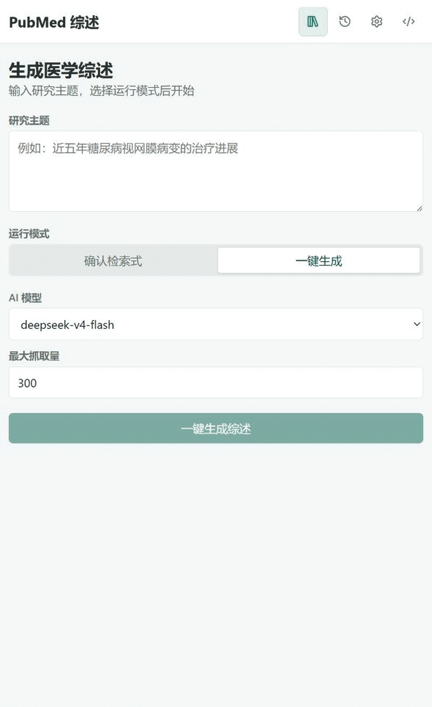

# PubMed 综述 PWA

在浏览器中将研究主题转化为可编辑的中文医学综述：生成 PubMed 检索式、获取与筛选文献、撰写正文、整理引用，并导出 Word 文档。

[](https://zhang-bin-98.github.io/pubmed-summary-pwa/) [](https://github.com/zhang-bin-98/pubmed-summary-pwa/actions/workflows/deploy-pages.yml)

<p align="center">
  <a href="https://zhang-bin-98.github.io/pubmed-summary-pwa/">
    
  </a>
</p>

<p align="center"><sub>真实线上流程及 Word 文档结果预览；等待过程已加速和抽帧，实际耗时取决于文献量与 AI 服务。</sub></p>

## 功能亮点

- 从研究主题生成 PubMed 检索式，并获取预计命中数量。
- 支持“一键生成”和“确认检索式”两种模式；后者允许在检索前人工修改查询。
- 自动完成摘要获取、并行相关性筛选、上下文选择、大纲生成、正文撰写和引用编号整理。
- 支持 OpenAI-compatible Chat Completions 供应商（默认为Deepseek），可自动读取模型列表，也可手动填写模型 ID。
- My NCBI API Key 可选；未配置时使用匿名访问并限制请求频率。
- 自动导出 DOCX；历史记录还可重新导出 DOCX、JSON 和 CSV。
- 运行状态和中间检查点保存在本地，失败或取消的任务可从历史记录继续。
- 支持安装为 PWA；离线时仍可查看历史并重新导出已有结果。

## 快速开始

1. 打开[在线应用](https://zhang-bin-98.github.io/pubmed-summary-pwa/)并进入“设置”，填写 Chat Completions Base URL 和 AI API Key。应用会自动获取模型列表；如果供应商不支持模型接口，也可以手动填写模型 ID。
2. 根据需要填写 My NCBI API Key。分别测试或明确跳过 AI 与 NCBI 连接测试，然后保存设置。
3. 回到“工作台”，输入研究主题，选择模型、最大抓取量和“一键生成”或“确认检索式”模式。
4. 开始生成。任务完成后会自动下载 Word 文档，也可以在“历史记录”中再次导出。

## 配置说明

| 配置 | 必填 | 默认值 | 说明 |
| --- | --- | --- | --- |
| Chat Completions Base URL | 是 | `https://api.deepseek.com` | 必须是 HTTPS 地址，并允许浏览器跨域请求 |
| AI API Key | 是 | — | 通过 Bearer Token 发送给所配置的 AI 供应商 |
| AI 模型 ID | 是 | `deepseek-v4-flash` | 优先从模型列表选择；获取失败时可手动填写 |
| 上下文长度 | 是 | `1,000,000` | 最低 `16,000`；模型接口返回上下文信息时会自动更新 |
| My NCBI API Key | 否 | 空 | 留空时匿名访问，当前页面内的请求间隔不少于 350 ms |
| 默认抓取量 | 是 | `300` | 可设置为 10–300 篇 |

AI 供应商需要支持：

- 浏览器 CORS；
- Bearer API Key；
- OpenAI-compatible `POST /chat/completions`；
- 可选的 `GET /models`。该接口不可用时仍可手动填写模型 ID。

保存前，AI 与 NCBI 连接都需要完成测试或明确选择“跳过测试”。跳过测试只表示允许保存，不代表配置一定可用。

My NCBI API Key 留空时，应用仅在当前页面内为匿名请求安排至少 350 ms 的间隔。NCBI 官方对无 Key 请求的限制为每个 IP 每秒不超过 3 次；API Key 的默认配额为每秒 10 次，有 Key 的请求仍受 NCBI 配额约束。详情参见 [NCBI E-utilities 使用政策](https://www.ncbi.nlm.nih.gov/books/NBK25497/?report=printable)。

## 工作流程

1. AI 根据研究主题和当前日期生成 PubMed 检索式。
2. NCBI 返回预计命中数量。
3. “确认检索式”模式允许检查和修改查询；“一键生成”模式直接继续。
4. 从 PubMed 获取最多指定数量的文献及摘要。
5. 将摘要分批交给 AI 并行筛选相关性，再按模型上下文长度选择证据。
6. 根据入选文献生成大纲和综述正文。
7. 校验并重排引用编号，仅保留正文实际引用的参考文献，随后生成 DOCX。

## 数据、隐私与使用边界

### 数据与网络请求

API Key、设置、历史记录、文献、中间检查点和生成结果保存在当前浏览器的 IndexedDB 中，不会上传到本项目服务器。

运行任务时，数据仍会直接发送给相应的第三方服务：

- 研究主题、提示词和用于生成的 PubMed 文献摘要会发送给你配置的 AI 供应商；
- PubMed 检索式以及可选的 My NCBI API Key 会发送给 NCBI；
- AI API Key 会发送给你配置的 AI 供应商。

请阅读相应服务的隐私与数据使用政策。共用设备、浏览器扩展或能够访问浏览器配置文件的软件可能读取本地数据，请仅在可信设备上使用。设置页提供“清除全部本地数据”功能。

### PWA 与离线能力

应用会缓存运行所需的静态文件，但不会把 AI 或 NCBI API 响应写入 Service Worker 运行时缓存。

离线时可以打开已缓存的应用、查看本地历史并重新导出已有结果；无法发起新的 PubMed 检索或 AI 请求。

### 医疗与引用限制

本项目用于文献整理和研究辅助，不构成医疗建议，也不应直接用于临床诊断、治疗决策或患者管理。

引用校验仅检查引用编号是否存在、按首次出现顺序重新编号，并生成对应的参考文献列表。它不会验证医学结论是否真实，也不会判断正文观点是否得到所引用文献的充分支持。使用前请人工核对原始文献、检索范围、引用对应关系和生成内容。

大规模任务会产生多次 AI 请求，可能受到供应商速率限制并产生费用。

## 本地开发

项目 CI 使用 Node.js 24。

```bash
git clone https://github.com/zhang-bin-98/pubmed-summary-pwa.git
cd pubmed-summary-pwa
npm ci
npm run dev
```

常用检查命令：

```bash
npm test
npm run lint
npm run build
npm run e2e
```

`npm run e2e` 会构建应用并启动本地预览服务器，然后运行桌面与移动端 Chromium 测试。

## 技术栈

- React、TypeScript、Vite
- Dexie 与 IndexedDB
- NCBI Entrez E-Utilities
- OpenAI-compatible Chat Completions API
- `docx`、`fast-xml-parser`、Zod
- Vite PWA / Workbox
- Vitest、Testing Library、Playwright
