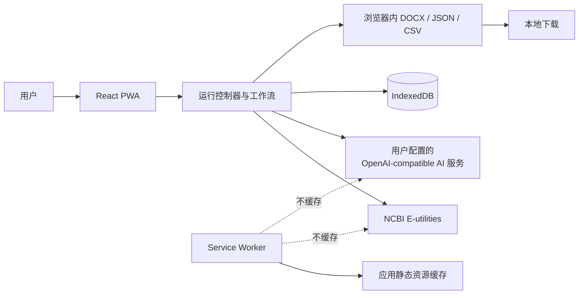
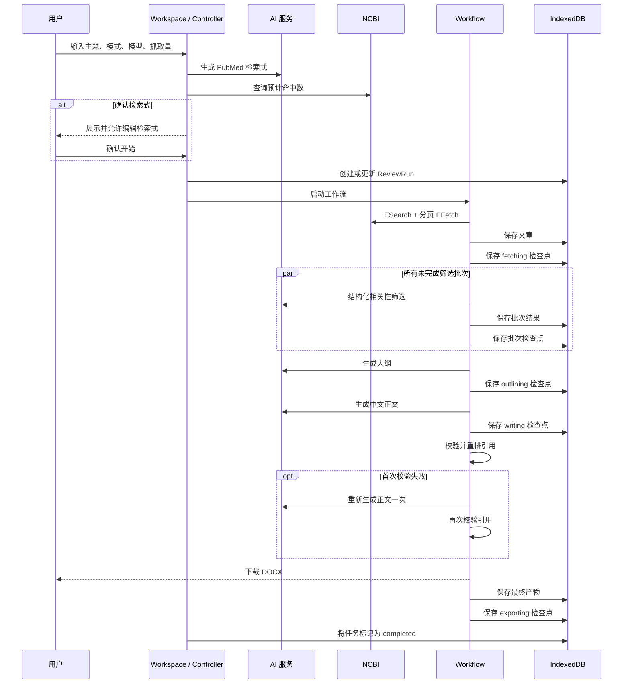

# PubMed 综述 PWA 架构文档

## 1. 文档目的

本文描述当前实现的运行边界、模块职责、数据流、持久化、恢复机制和安全边界。它是面向维护者的现状文档，不是待执行的实施计划。

产品目标、用户流程和功能边界见 [产品文档](PRODUCT.md)。本文整合了原 `docs/superpowers` 中仍然有效的设计，旧文件可从 Git 历史追溯；若历史描述与本文不一致，以当前代码和测试为准。

## 2. 系统上下文

应用是由 GitHub Pages 托管的 React 单页应用。浏览器同时承担 UI、工作流编排、数据存储、文档生成和下载，不存在项目自建的运行时后端。



主要运行边界：

- 应用代码和静态资源来自当前站点来源。
- NCBI 请求固定发往 `eutils.ncbi.nlm.nih.gov`。
- AI 请求发往用户填写的 HTTPS Base URL。
- 设置、凭据和任务数据只持久化在当前站点来源的 IndexedDB。
- 导出文件在浏览器内构建，通过临时 Object URL 下载。

## 3. 技术栈与目录职责

| 层 | 主要技术或模块 | 职责 |
| --- | --- | --- |
| 应用壳 | React、`src/app` | 顶部导航、设置门槛、联网状态和视图切换 |
| 设置 | `src/settings` | 配置加载、模型发现、连接测试、保存与清除凭据 |
| 工作台 | `src/workspace` | 主题输入、运行模式、进度、取消、完成和重试入口 |
| 工作流 | `src/workflow` | 阶段编排、筛选、上下文预算、引用校验和检查点 |
| 外部 API | `src/api` | OpenAI-compatible AI 客户端和 NCBI E-utilities 客户端 |
| PubMed 解析 | `src/pubmed` | 将 PubMed XML 转换为领域对象 |
| 提示词 | `src/prompts` | 版本化检索、大纲、写作和相关性筛选提示词 |
| 持久化 | Dexie、`src/storage` | IndexedDB schema 和仓储操作 |
| 历史 | `src/history` | 运行列表、继续任务、删除、存储量和重新导出 |
| 导出 | `docx`、`src/export` | DOCX 生成以及 JSON、CSV 序列化和下载 |
| PWA | Vite、Workbox、`vite-plugin-pwa` | 构建、manifest、静态预缓存和更新提示 |

领域类型集中在 `src/domain/models.ts`，外部依赖通过 `createWorkflowDeps` 适配到 `runWorkflow` 所需接口，使核心流程可以使用测试替身独立验证。

## 4. 入口与状态边界

### 4.1 应用入口

`src/main.tsx` 注册 Service Worker 并挂载 React。发现新版本时，页面增加“更新应用”按钮，由用户触发 Service Worker 更新。

`App` 负责三个顶层视图：

- `workspace`：新建和执行综述任务；
- `history`：查看、继续、导出或删除历史；
- `settings`：配置 AI 和 NCBI 连接。

进入工作台的门槛是：AI API Key 非空，并且 AI、NCBI 两项连接决定都为 `passed` 或 `skipped`。NCBI Key 本身不属于门槛。

### 4.2 UI 状态与持久化状态

`useReviewController` 的 UI 状态用于控制当前页面：

- `idle`
- `generating-query`
- `confirming-query`
- `running`
- `completed`
- `failed`
- `cancelled`

任务开始后，`ReviewRun` 另行持久化阶段和状态。领域模型定义了 `fetching`、`screening`、`outlining`、`writing`、`validating-citations`、`exporting` 和 `completed` 等工作流阶段；异常时落为 `failed` 或 `cancelled`。当前工作流没有发出独立的 `writing` 进度事件，因此运行记录在大纲和正文请求期间通常保持 `outlining`，正文仍有单独的 `writing` 检查点。领域类型还保留 `draft` 与 `awaiting-query-confirmation`，但当前控制器不会在正式抓取前创建持久化任务。

### 4.3 取消信号

每次生成检索式或启动任务都会创建一个 `AbortController`。新的操作会先取消上一个操作，组件卸载时也会取消当前操作。同一个 `AbortSignal` 沿控制器、工作流、AI 客户端、NCBI 客户端和匿名请求队列向下传递。

## 5. 端到端数据流



生成检索式和命中数查询发生在正式 `runWorkflow` 之前。一键模式直接把结果交给工作流；确认模式先进入可编辑状态。

## 6. 工作流实现

### 6.1 获取与解析

`createWorkflowDeps.fetchArticles` 执行以下步骤：

1. 调用 ESearch，启用 NCBI History Server。
2. 取 `命中数` 与 `最大抓取量` 的较小值。
3. 以 100 篇为一页调用 EFetch 获取 XML。
4. 解析并合并页面，使用 `sourceOrder` 保留 PubMed 返回顺序。
5. 保存文章并返回；`runWorkflow` 随后另行写入 `fetching` 检查点。
6. 在进入筛选前移除无摘要文章；全部无摘要时以 `no-abstracts` 失败。

XML 解析异常被归一化为 `xml` 工作流错误。

### 6.2 相关性筛选

`batchArticlesForScreening` 按以下两个条件切分批次：

- 每批最多 20 篇；
- 估算输入不超过约 24,000 token。

每个批次要求 AI 返回 JSON，包含输入中每个文章 ID 的 0–3 分、纳入决定和理由。Zod 校验响应结构，并检查返回 ID 与输入 ID 完全一致；格式不合格时最多再请求一次。

当前调度器会立即启动所有未完成批次，没有人为设置并发上限或启动间隔。每批完成后立即保存 `ScreeningDecision` 和独立检查点；全部批次完成后按 `sourceOrder` 稳定排序。并发完成顺序不会改变后续证据顺序。

所有批次在开始时即已派发。某批失败后，其余已派发批次仍会结束并保存成功结果，随后整个筛选阶段以首个错误失败。

### 6.3 上下文预算

`selectWithinContext` 只考虑筛选为相关的文章，并按“相关性分数降序、原始顺序升序”排列。可用输入预算为：

```text
上下文长度 - 空证据包头部估算 - max(12,000, 上下文长度的 25%)
```

“空证据包头部估算”只覆盖主题、日期和证据包结构，不包含完整的大纲或写作提示词，因此预算是保守性有限的启发式估算。最后一项为输出预留。选择以完整文章对象为单位，放不下的文章整体省略，不截断摘要。

设置页会在 `/models` 返回上下文元数据时更新草稿值；运行时则信任已保存的上下文长度，不使用供应商 tokenizer，也不进行实时能力校验。

### 6.4 大纲、正文与提示词

检索、大纲和写作提示词保存在 `src/prompts/original`，相关性提示词在 `src/prompts/relevance-v1.ts`。`GenerationArtifact.promptVersions` 记录每类提示词的版本。

当前用户选择的同一个模型用于检索式、筛选、大纲和正文。证据包包含主题、当前日期以及入选文献的 PubMed 元数据和摘要。

### 6.5 引用与参考文献

应用先为上下文文献建立源编号到 AMA 风格参考文献的映射，然后：

1. 识别正文中的数字引用组，如 `[1]` 或 `[1, 3]`；
2. 拒绝不存在于证据映射中的编号；
3. 按正文首次出现顺序重新编号；
4. 只输出正文实际引用的参考文献。

有证据文献但正文完全没有引用时也视为校验失败。首次失败会以温度 0 重新生成正文一次，第二次失败则返回 `citation-validation`，不会导出 DOCX。

### 6.6 导出

DOCX 在浏览器中动态构建，包含：

- 居中标题；
- 自动编号的三级标题；
- 中文正文；
- 正文实际引用的参考文献。

完成时先触发下载，再保存最终 `GenerationArtifact` 和 `exporting` 检查点。历史页使用保存的校验后正文和参考文献重新构建 DOCX，不依赖网络。

JSON 导出只包含 run、articles、screening 和 artifact；CSV 导出只包含文献及筛选字段，因此两者都不读取 settings 表。

## 7. 外部 API 适配器

### 7.1 OpenAI-compatible AI 客户端

`src/api/deepseekClient.ts` 的类名保留为 `DeepSeekClient` 以兼容已有调用方，但运行语义已经是可配置的 OpenAI-compatible 客户端。

客户端行为：

- Base URL 去除首尾空白和末尾斜杠，并强制使用 HTTPS；
- `GET {baseUrl}/models` 拉取模型列表；
- `POST {baseUrl}/chat/completions` 发送单条 user message；
- 使用 Bearer Authorization；
- 支持普通文本或分段文本形式的响应内容；
- 使用 Zod 校验模型列表和 completion 响应的必要结构；
- 对 429 和 5xx 最多重试 3 次，采用 500/1000/2000 ms 加少量随机抖动；
- 将认证、限流、网络和响应错误归一化为 provider 错误码。

进行中的 AI fetch 可由 `AbortSignal` 取消，但 AI 重试的退避等待本身不监听取消信号；如果恰好在退避期间取消，通常要等到下一次 fetch 才会观察到取消。NCBI 的退避和匿名排队等待则都支持立即取消。

模型列表请求用于提升设置体验，不是生成的硬依赖。自动拉取失败时可保留或填写模型 ID；AI 连接测试最终通过一次短的 Chat Completions 请求验证该模型。

### 7.2 NCBI 客户端

`NcbiClient` 使用表单编码的 POST 请求访问：

- `esearch.fcgi`：获取 ID、History Server 信息或仅查询命中数；
- `efetch.fcgi`：按 History Server 分页获取摘要 XML。

构造时会修剪 NCBI Key。Key 为空或只有空白时，所有请求体都省略 `api_key`；有 Key 时添加该参数。

匿名请求由模块级队列协调，因此当前页面内不同 `NcbiClient` 实例共享节流状态：第一个请求可立即发送，后续出站尝试至少间隔 350 ms。429/5xx 重试也重新进入队列，排队等待可以被 `AbortSignal` 取消。有 Key 的请求绕过此页面级调度器。

客户端对 429 和 5xx 最多重试 3 次，并把限流、网络和响应错误归一化为 NCBI 错误码。

## 8. IndexedDB 数据模型

数据库名为 `pubmed-summary-pwa`，当前 schema 版本为 1。

| 表 | 主键 / 索引 | 内容 |
| --- | --- | --- |
| `settings` | `id` | 单条 `AppSettings`，固定写入 `id = 1` |
| `runs` | `id`; `updatedAt`, `status` | 主题、查询、模型、阶段、状态、统计与错误 |
| `articles` | `id`; `runId`, `pmid` | PubMed 元数据、摘要和原始顺序 |
| `screening` | `id`; `runId`, `articleId` | 分数、纳入决定、理由和提示词版本 |
| `artifacts` | `runId` | 大纲、原始正文、校验后正文、参考文献和提示词版本 |
| `checkpoints` | `id`; `runId`, `completedAt` | 阶段或筛选批次的可恢复载荷 |

删除单个任务会在一个 Dexie 事务中清理该任务跨表的数据。清除历史会清空除 settings 外的五张任务表；“清除全部本地数据”会删除并重新打开整个数据库。

## 9. 检查点与恢复语义

完整阶段检查点使用 `${runId}:${stage}`，筛选批次检查点使用 `${runId}:screening-batch:${batchIndex}`。

恢复顺序为：

1. 若存在完整 `screening` 检查点，直接恢复筛选结果；
2. 否则复用 `fetching` 检查点，避免重新请求 PubMed；
3. 扫描并验证筛选批次检查点，只请求缺失或不匹配的批次；
4. 依次复用 `outlining`、`writing` 和 `validating-citations` 检查点；
5. 再次执行导出并更新任务状态。

批次检查点除索引外还校验 run ID、批次数、文章 ID 顺序和决定结构，避免在输入变化后错误复用。

继续任务时复用原任务的主题、检索式、模型 ID、最大抓取量、模式和预计命中数；API Key、AI Base URL 与上下文长度来自当前设置。更换供应商后继续旧任务时，用户需要确保原模型 ID 在新供应商中仍然有效。

上下文选择没有独立检查点，恢复时会用当前上下文长度重新计算。已有的大纲、正文或引用校验检查点不会核对新的文章选择集；因此在任务中断后修改上下文长度，可能形成“新选择集配合旧下游产物”的组合，这是当前恢复协议的已知限制。

阶段载荷与对应检查点不是事务写入：例如文章先保存、`fetching` 检查点后保存，筛选决定先保存、批次检查点后保存；任务进度写入 `ReviewRun` 也是独立操作。崩溃窗口可能导致恢复时重复执行已完成工作。单条任务删除和清除历史才使用跨表 Dexie 事务。

## 10. 错误处理

工作流把底层错误归一化为稳定类别：认证、网络、限流、XML、无摘要、无相关文章、筛选格式、上下文预算、引用校验、存储配额、取消和未知错误。

进入工作流后，控制器在成功、失败或取消时都会尝试更新 `ReviewRun`。错误记录包含错误码和面向用户的消息；任务取消不会删除历史。首次读取/保存任务、创建客户端或适配依赖发生在最终状态捕获范围之外，若这些准备步骤失败，可能没有对应的最终状态写入；进度阶段的 `ReviewRun` 保存也是异步触发而非逐次等待。

历史页还会修复旧版已完成记录的统计语义：将旧 `selected` 迁移为 `contextSelected`，并以最终 artifact 的参考文献数重算正文实际引用量。

## 11. 安全与隐私架构

### 11.1 凭据边界

- 凭据只写入 IndexedDB settings 表，并直接用于浏览器到外部服务的请求。
- AI Key 放在 Authorization header；若已配置 NCBI Key，它会随每个 NCBI search、count 和 EFetch POST 表单体发送，但不进入 URL。
- 运行记录和导出逻辑不读取 settings，因此 API Key 不进入 DOCX、JSON 或 CSV。
- Service Worker 不缓存 API 请求或响应。

纯前端架构无法向浏览器本身隐藏凭据。共用设备、恶意扩展、站点脚本供应链或 XSS 都可能突破本地存储边界，因此应用只适合在可信设备使用。

### 11.2 浏览器策略

`index.html` 的 CSP 采用以下边界：

- 脚本、worker 和基础资源限于同源；
- 对象嵌入被禁用；
- 表单提交限于同源；
- 网络连接允许同源和 HTTPS，以支持用户配置的供应商。

由于 `connect-src` 必须允许任意 HTTPS 供应商，CSP 不能替代供应商信任判断。

## 12. PWA、构建与部署

Vite 根据 GitHub Actions 环境和仓库名生成 Pages base path。Workbox 预缓存 JS、CSS、HTML、PNG 和 ICO，使用 `index.html` 作为 SPA 导航回退，并明确不配置 API runtime caching。

GitHub Pages workflow 在推送到 `main` 或手动触发时执行：

1. 使用 Node.js 24 和 `npm ci` 安装依赖；
2. 运行 `npm test`；
3. 运行 `npm run build`；
4. 上传 `dist` 并部署到 GitHub Pages。

本地质量命令包括：

```bash
npm test
npm run lint
npm run build
npm run e2e
```

单元和组件测试使用 Vitest、Testing Library、jsdom 与 fake-indexeddb；端到端测试使用 Playwright，覆盖完整生成流程和离线历史场景。

## 13. 已知约束与架构取舍

- 无后端降低了部署和运维成本，但浏览器必须持有用户凭据，且外部 API 必须允许 CORS。
- IndexedDB 支持本地恢复和离线导出，但没有跨设备同步；清理站点数据会永久删除记录。
- PubMed XML 在主线程解析；当前没有 Web Worker，大数据量时可能短暂占用 UI 线程。
- 筛选批次全部并行，缩短等待时间但可能触发 AI 供应商并发或速率限制；并发策略当前不可配置。
- 上下文预算基于启发式 token 估算和用户填写的上下文长度，不等同于供应商的精确 tokenizer 或实时模型能力。
- NCBI 匿名节流只协调当前页面，不能覆盖其他标签页、浏览器或同一公网 IP 下的客户端。
- 引用校验验证编号完整性和顺序，不执行语义蕴含、事实核查或医学证据等级评估。
- 新任务依赖 NCBI 与 AI 服务可用；PWA 的离线能力只覆盖静态界面，以及在已保存设置仍满足入口门槛时的历史查看和重新导出。

## 14. 历史设计整合

本文吸收了原 `docs/superpowers` 中 PubMed 综述基础设计、实施计划，以及一键生成与并行筛选设计、实施计划里仍然有效的架构决策。完成整合后，旧目录已删除；需要查看原始内容时可查阅 Git 历史。

相较于历史方案，当前实现的重要变化包括：NCBI Key 改为可选、AI 服务改为可配置的 OpenAI-compatible 供应商、模型可在连接测试前拉取或手填、上下文长度显式配置，以及筛选调度从历史的“最多 5 路并发并错峰启动”改为“所有未完成批次立即并行”。
